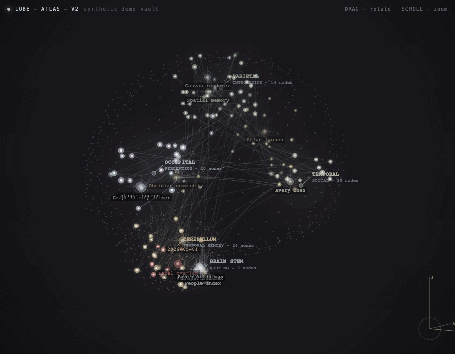
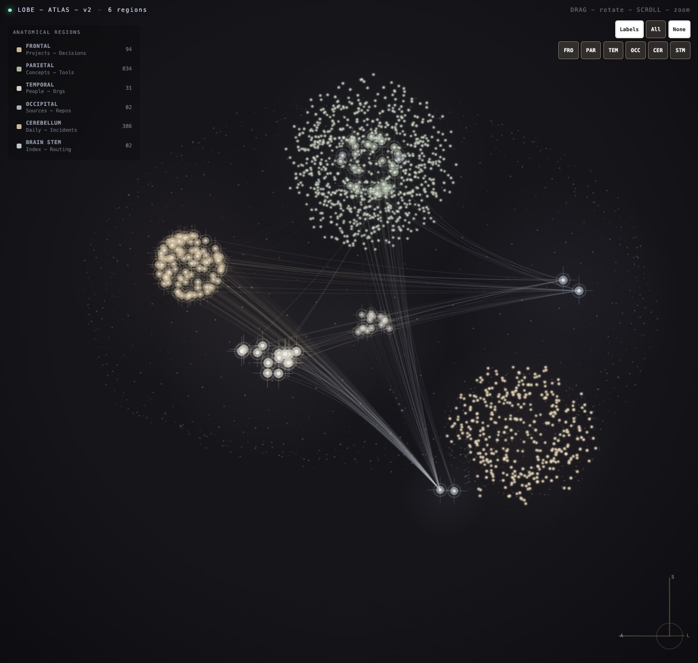

# Brain Atlas

[Install Brain Atlas from the Obsidian community plugin directory](https://community.obsidian.md/plugins/brain-atlas)

Brain Atlas is an Obsidian plugin that renders your vault as an animated 3D anatomical brain. Notes become nodes, links become neural pathways, and note types are grouped into brain regions.

The animated preview below uses synthetic demo vault data.





## What's New in 0.1.5

This release focuses on making Brain Atlas work with real vault taxonomies instead of requiring users to rename notes, folders, tags, or frontmatter.

- Map custom frontmatter values to categories, such as `type:wiki=source`.
- Map custom frontmatter values directly to regions, such as `type:person=temporal`.
- Map folders directly to regions, such as `Wiki=occipital` or `Channels=frontal`.
- Use the new Classification report in settings to see why notes landed in each region and which frontmatter values are still unmapped.
- Reduce dense label piles by capping automatic labels while keeping hover, focus, and major hub labels available.
- Use `DAYLIGHT`, `Balanced`, or `Battery saver` settings for light-mode and lower-idle-CPU workflows.

## Features

- Animated 3D brain view inside Obsidian.
- Vault-native graph data from `app.metadataCache`; no separate app or export step.
- Region mapping for projects, people, concepts, sources, daily notes, indexes, and related note kinds.
- Editable categorization settings for frontmatter keys, frontmatter value mappings, tag mappings, folder mappings, link inference, and the default category.
- Region override settings for placing specific notes, frontmatter values, tags, or folders in specific anatomical regions.
- Classification report that explains how notes are being categorized and surfaces unmapped frontmatter values.
- Region toggles for dimming or restoring anatomical lobes.
- Label toggle and density guardrails for hiding labels or preventing dense label piles.
- Light `Daylight` palette for users who prefer a brighter workspace.
- Optional performance presets for reducing idle animation frame rate on machines that run hot.
- Click a node to open the backing note.
- Drag a node to pin its position in the atlas.
- Local-only rendering. Brain Atlas does not send vault data to a server.

## Install

Brain Atlas is available in Obsidian's community plugin directory:

```text
https://community.obsidian.md/plugins/brain-atlas
```

1. Open `Settings -> Community plugins`.
2. Search for `Brain Atlas`.
3. Install and enable the plugin.
4. Run **Brain Atlas: Open atlas** from the command palette.

### Manual Install

1. Download these files from the latest repo version or release:
   - `manifest.json`
   - `main.js`
   - `styles.css`
2. In your vault, create:

   ```text
   .obsidian/plugins/brain-atlas/
   ```

3. Put the three downloaded files in that folder.
4. Reload Obsidian.
5. Enable `Brain Atlas` in `Settings -> Community plugins`.
6. Open the command palette and run `Brain Atlas: Open atlas`.

### Build from Source

```bash
npm install
npm test
npm run build
mkdir -p /path/to/your/vault/.obsidian/plugins/brain-atlas
cp manifest.json main.js styles.css /path/to/your/vault/.obsidian/plugins/brain-atlas/
```

Then reload Obsidian and enable the plugin.

## Usage

Run `Brain Atlas: Open atlas` from the command palette or click the brain ribbon icon.

Controls:

- Drag empty space to rotate.
- Drag a node to pin it in place.
- Scroll to zoom.
- Right-click to reset the camera.
- `Labels` toggles all canvas labels.
- `All` restores every region.
- `None` dims every region.
- `FRO`, `PAR`, `TEM`, `OCC`, `CER`, and `STM` toggle individual brain regions.

Settings:

- `Theme palette` includes the light `DAYLIGHT` palette.
- `Performance preset` defaults to `Smooth (current)`. `Balanced` and `Battery saver` keep interactions responsive while reducing idle redraw rate.
- `Classification report` explains how notes were grouped and suggests mappings for unknown frontmatter values.
- `Frontmatter value mappings` let existing vault metadata drive categories without renaming fields or values.
- `Folder region mappings` help folder-heavy vaults spread notes across anatomical regions.

## How Notes Are Classified

Brain Atlas assigns each note to a lobe using this order:

1. Frontmatter value mappings, such as `type:wiki=source`.
2. Frontmatter keys: `kind`, `type`, or `category`.
3. Tags such as `#project`, `#person`, `#source`, `#daily`, or `#index`.
4. Folder names such as `Projects`, `People`, `Sources`, `Daily`, `Concepts`, or `Index`.
5. Date-like filenames for daily notes.
6. Link behavior inference, when enabled.
7. Fallback to the configured default category.

After a note is categorized, optional region overrides can place it in a specific anatomical region without changing its category or color. Region override precedence is:

1. Exact note path mappings, such as `Projects/Big Idea.md=frontal`.
2. Frontmatter value mappings, such as `type:wiki=occipital`.
3. Frontmatter region fields, such as `brain_region: temporal`.
4. Tag region mappings, such as `client=temporal`.
5. Folder region mappings, such as `Wiki=occipital`.
6. The default category-to-lobe mapping below.

You can edit the mapping in `Settings -> Brain Atlas -> Categorization`:

- `Default category` controls where unmatched notes go.
- `Infer categories from links` lets heavily connected unmatched notes use graph behavior as a hint.
- `Frontmatter fields` controls which frontmatter keys are checked for kind values.
- `Frontmatter value mappings` accepts one `field:value=category` pair per line.
- `Tag mappings` accepts one `tag=category` pair per line. Tags do not need `#`.
- `Folder mappings` accepts one `folder=category` pair per line. Folder names can match any path ancestor.

Frontmatter category examples:

```text
type:wiki=source
type:person=person
class:meeting=workThread
```

You can edit anatomical placement in `Settings -> Brain Atlas -> Region overrides`:

- `Frontmatter region keys` controls which frontmatter fields are checked for region names.
- `Frontmatter region value mappings` accepts one `field:value=region` pair per line.
- `Tag region mappings` accepts one `tag=region` pair per line. Tags do not need `#`.
- `Folder region mappings` accepts one `folder=region` pair per line. Folder names can match any path ancestor.
- `Note region mappings` accepts one `note/path.md=region` pair per line.
- Supported regions are `frontal`, `parietal`, `temporal`, `occipital`, `cerebellum`, and `stem`.

Region override examples:

```text
type:wiki=occipital
type:person=temporal
Wiki=occipital
Channels=frontal
Inbox=stem
```

Use the `Classification report` in settings when a vault lands mostly in one lobe. It shows note counts by region and classification source, plus unmapped frontmatter values with suggested mapping strings.

Default lobe mapping:

| Region | Notes |
| --- | --- |
| Frontal | projects, decisions, questions |
| Parietal | concepts, tools, work threads |
| Temporal | people, organizations |
| Occipital | sources, repos |
| Cerebellum | daily notes, incidents |
| Brain stem | indexes, routing notes |

## Privacy

Brain Atlas reads Obsidian's local vault metadata and renders it in a local canvas view. It enumerates Markdown files in the vault with Obsidian's vault API, then uses each note's path, basename, frontmatter, tags, links, and embeds from Obsidian's metadata cache to build the graph. It does not read full note contents, make network requests, upload vault data, or require an account.

Because note names and paths appear visually in the graph when labels are enabled, use the `Labels` toggle before screensharing if your vault contains private note titles.

## Development

```bash
npm install
npm test
npm run build
```

During development, you can copy `manifest.json`, `main.js`, and `styles.css` into a vault plugin folder after each build.

### Release

Release assets are built and attested by GitHub Actions. Do not upload locally built `main.js` or `styles.css` for public releases unless you are intentionally replacing the automated provenance flow.

1. Update the version in `manifest.json`, `package.json`, `package-lock.json`, and `versions.json`.
2. Run:

   ```bash
   npm test
   npm run build
   ```

3. Commit and push the version bump.
4. Create and push a semver tag that matches `manifest.json`, for example:

   ```bash
   git tag 0.1.5
   git push origin 0.1.5
   ```

5. The `Release` workflow creates or updates the GitHub release, uploads `manifest.json`, `main.js`, and `styles.css`, and generates artifact attestations for those assets.

For an existing release that needs assets rebuilt or re-attested, run the `Release` workflow manually with the `version` input set to the release tag, for example `0.1.3`.

To verify release asset provenance locally:

```bash
gh attestation verify main.js -R colorpulse6/brain-atlas
gh attestation verify manifest.json -R colorpulse6/brain-atlas
gh attestation verify styles.css -R colorpulse6/brain-atlas
```

### Demo Capture

The README animation is generated from synthetic data, not a real vault:

```bash
npm run demo:build
open demo/index.html
```

### Test Vaults

Generate local Obsidian vaults for checking different user setups:

```bash
npm run build
npm run test-vaults:seed
```

This creates ignored vault folders in `test-vaults/brain-atlas/` and installs the current local plugin build into each vault:

- `01-folder-heavy-raw`: sparse tags, broad folders, mostly default classification.
- `02-folder-heavy-configured`: same structure with folder category and region mappings.
- `03-frontmatter-heavy-raw`: arbitrary frontmatter values such as `type: wiki`.
- `04-frontmatter-heavy-configured`: same structure with frontmatter value mappings.
- `05-tag-heavy-pkm`: canonical tag-heavy PKM setup.
- `06-messy-import`: imported/UUID-like notes for label-density testing.

Open any generated folder as an Obsidian vault, then run `Brain Atlas: Open atlas`.

## Author

Built by [Nichalas Barnes](https://nichalasbarnes.com/), a software engineer and composer. More work at [nichalasbarnes.com/projects](https://nichalasbarnes.com/projects/).

You might also like [Cerebro Mycelium](https://github.com/colorpulse6/cerebro-mycelium), which renders your vault as a 2D living fungal network.

## License

MIT
